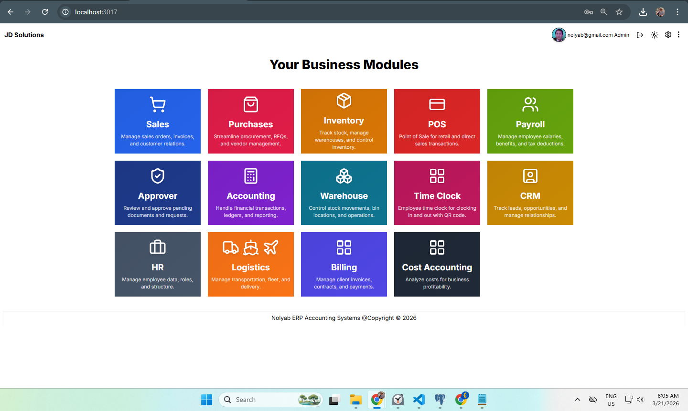

# ERP System (Inventory, Accounting, POS, Payroll)

A full-stack ERP system designed to handle real-world business operations including accounting, inventory, payroll, and POS workflows used in daily transactions.

> Screenshot main Dashboard (ERP System)

## Features
- **Inventory Management** – Track stock levels, items, suppliers
- **Payroll System** – Employee salaries, deductions, payslips
- **POS (Point of Sale)** – Fast transactions, receipts, cash management
- **Accounting** – Journal entries, debit/credit ledger, financial reports

## Tech Stack
- Frontend: React.js + Next.js
- Backend: Node.js (Express)
- Database: PostgreSQL
- Other: Complex SQL queries, joins, modular architecture

## System Design
- Multi-module ERP architecture
- Relational database design using PostgreSQL
- Use of joins and views for financial reporting
- Separation of frontend and backend (API-based architecture)
  
## Highlights
- Real-world business workflows implemented
- Advanced database operations
- Clean, scalable, and modular code design

## 🎯 Purpose
This system was built to solve real-world business challenges such as:
- Manual accounting errors
- Inventory tracking issues
- Inefficient payroll processing

 ## 💡 Why This Project Matters
This project demonstrates the ability to design and build complex business systems from the ground up, focusing on scalability, maintainability, and real-world usability.

## Author
Baylon Yap  
GitHub: [bqygithub](https://github.com/bqygithub)
